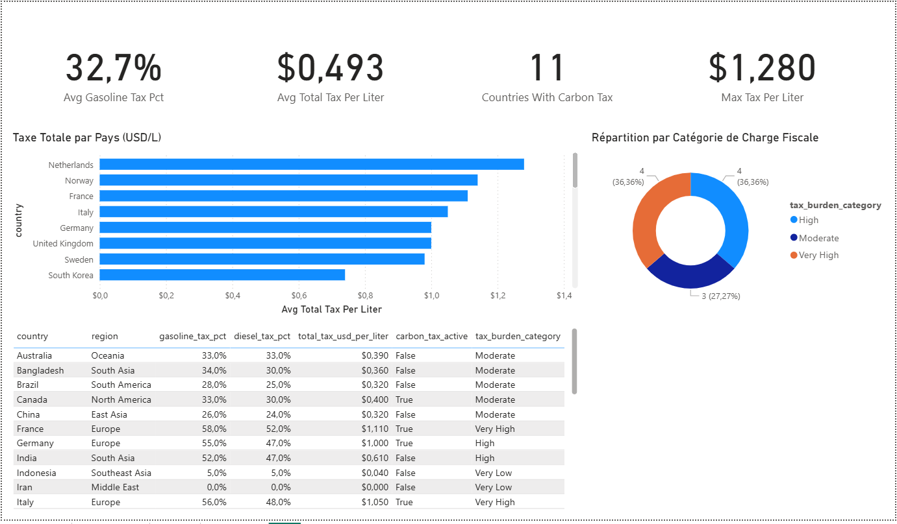
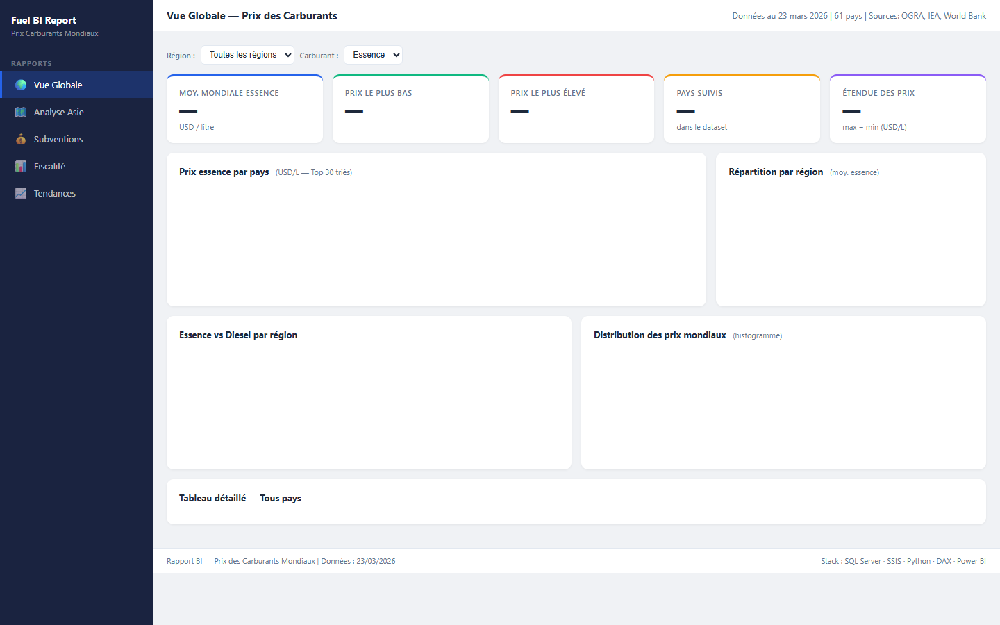

# Fuel Prices BI Dashboard

> **v0.0** — Initial release · No UI design applied yet

A complete **Power BI analytics project** tracking global fuel prices across 150+ countries, built with a full data engineering stack.

---

## Screenshots

### Vue Globale — Prix des Carburants


### Analyse Asie


### Fiscalité


### Tendances


---

## Architecture

```
CSV Files (6 sources)
       │
       ▼
 etl_pipeline.py          ← Python ETL (Extract → Transform → Load)
       │
       ▼
SQL Server — FuelPricesBI
 ├── staging.*            ← Raw CSV data
 ├── dw.*                 ← Star schema (Dimensions + Facts)
 │    ├── DimCountry
 │    ├── DimDate
 │    ├── DimSubsidyPolicy
 │    ├── FactFuelPrices
 │    ├── FactCrudeOil
 │    ├── FactTaxPolicy
 │    └── FactMonthlyTrend
 └── rpt.*                ← Reporting views (used by Power BI)
       │
       ▼
Power BI Semantic Model (model.bim)
  ├── 6 tables + relationships
  ├── Parameter: DataPath (CSV folder)
  └── 30+ DAX measures
       │
       ▼
Power BI Report (4 pages)
  ├── Vue Globale    — World KPIs, map, country rankings
  ├── Tendances      — Monthly trends, Brent correlation
  ├── Asie           — Asia deep dive (affordability, EV, CO2)
  └── Fiscalite      — Tax burden comparison, carbon tax
```

---

## Data Sources

| File | Description |
|------|-------------|
| `global_fuel_prices.csv` | Gasoline & diesel prices (USD/L) — all countries |
| `asia_fuel_prices_detailed.csv` | Asia: LPG, affordability index, EV adoption, CO2 |
| `asia_subsidy_tracker.csv` | Fuel subsidy tracking — type, cost, % GDP |
| `crude_oil_annual.csv` | Brent & WTI annual prices (2015–2026) |
| `fuel_tax_comparison.csv` | Tax breakdown per country — excise, VAT, carbon tax |
| `price_trend_monthly.csv` | Monthly price trends — MoM & YoY changes |

---

## Project Structure

```
fuel-prices-bi/
├── etl_pipeline.py                        # Python ETL pipeline
├── sql_server_schema.sql                  # SQL Server schema + stored procedures + views
├── dax_measures.md                        # 30+ DAX measures documentation
├── fuel_prices_dashboard.html             # Standalone HTML dashboard (Chart.js)
├── fuel_prices_report.pbip                # Power BI project file
├── fuel_prices_report.Dataset/
│   ├── model.bim                          # Semantic model (tables, relations, params)
│   └── definition.pbism
└── fuel_prices_report.Report/
    ├── report.json                        # Report definition (visuals, pages, config)
    └── definition.pbir
```

---

## Key DAX Measures

| Category | Measures |
|----------|----------|
| **Global KPIs** | `Avg Gasoline Global`, `Median Gasoline Global`, `Countries Count`, `Max/Min Gasoline Price`, `Price Range` |
| **Rankings** | `Country Gasoline World Rank`, `Most Expensive Country`, `Cheapest Country` |
| **Subsidies** | `Total Subsidy Cost Bn USD`, `Subsidized Countries Count`, `Avg Subsidy Pct GDP` |
| **Tax** | `Avg Gasoline Tax Pct`, `Countries With Carbon Tax`, `Avg Tax Share Of Price Pct` |
| **Crude Oil** | `Brent Latest Year`, `WTI Latest Year`, `Brent YoY Change Selected Year`, `Brent Peak Year` |
| **Trends** | `Avg MoM Change Pct`, `Avg YoY Change Pct`, `Gasoline 3M Moving Avg` |
| **Asia** | `Avg Affordability Index Asia`, `Avg EV Adoption Pct Asia`, `Total CO2 Transport MT` |

---

## ETL Pipeline

The Python ETL (`etl_pipeline.py`) implements a full **Extract → Transform → Load** cycle:

1. **Extract** — reads 6 CSV files with `pandas`
2. **Transform** — per-table cleaning (types, booleans, deduplication, null handling)
3. **Quality checks** — validates nulls, negative prices, data completeness
4. **Load** — writes to SQL Server `staging.*` via SQLAlchemy (`chunked, multi-row inserts`)
5. **DW procedures** — calls 4 stored procedures to populate the star schema
6. **Analytics** — generates regional averages, Top 5 rankings, Brent correlation (r=0.87), exports `analysis_summary.csv`

---

## SQL Server Schema

Three schemas with clear separation of concerns:

| Schema | Purpose |
|--------|---------|
| `staging` | Raw CSV data loaded by Python |
| `dw` | Star schema — dimensions + fact tables |
| `rpt` | Views consumed directly by Power BI |

**Stored Procedures:**
- `dw.usp_LoadDimCountry` — MERGE upsert for country dimension
- `dw.usp_LoadFactFuelPrices` — full reload of price facts
- `dw.usp_LoadFactCrudeOil` — Brent/WTI annual data
- `dw.usp_LoadFactMonthlyTrend` — monthly trend data
- `dw.usp_RunFullETL` — orchestrates all 4 procedures

---

## Setup

### Prerequisites
- Python 3.9+
- SQL Server (local or remote) with ODBC Driver 17
- Power BI Desktop (for `.pbip` format)

### 1 — Install Python dependencies
```bash
pip install pandas sqlalchemy pyodbc
```

### 2 — Place CSV files
Copy the 6 CSV files to:
```
C:\Users\<you>\Downloads\Compressed\archive_3\
```
Or update `DATA_DIR` in `etl_pipeline.py`.

### 3 — Create the database
```sql
-- Run in SSMS or sqlcmd:
sqlcmd -S localhost -i sql_server_schema.sql
```

### 4 — Run the ETL
```bash
python etl_pipeline.py
```

### 5 — Open in Power BI
Open `fuel_prices_report.pbip` in Power BI Desktop.
Update the `DataPath` parameter if needed (Model → Parameters).

### 6 — HTML Dashboard (no dependencies)
Open `fuel_prices_dashboard.html` directly in a browser.

---

## Tech Stack

| Layer | Technology |
|-------|-----------|
| Data ingestion | Python, pandas, SQLAlchemy |
| Database | SQL Server 2019+, T-SQL |
| BI Semantic Model | Power BI PBIP format, DAX |
| Visualization | Power BI Desktop, Chart.js (HTML) |
| Version control | Git, GitHub |

---

## Roadmap

- [x] v0.0 — ETL pipeline, SQL schema, semantic model, 4-page report
- [ ] v0.1 — UI design: per-page color themes, styled KPI cards, chart borders
- [ ] v0.2 — Add README screenshots from Power BI
- [ ] v1.0 — Full production release

---

## License

MIT
